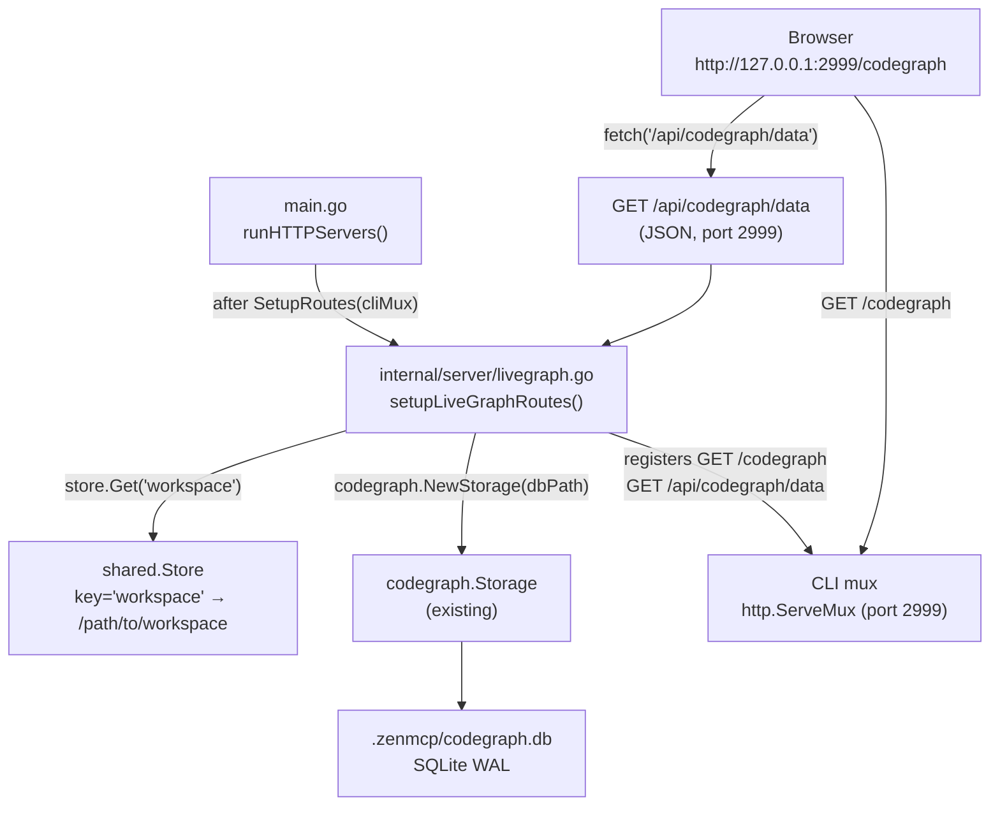
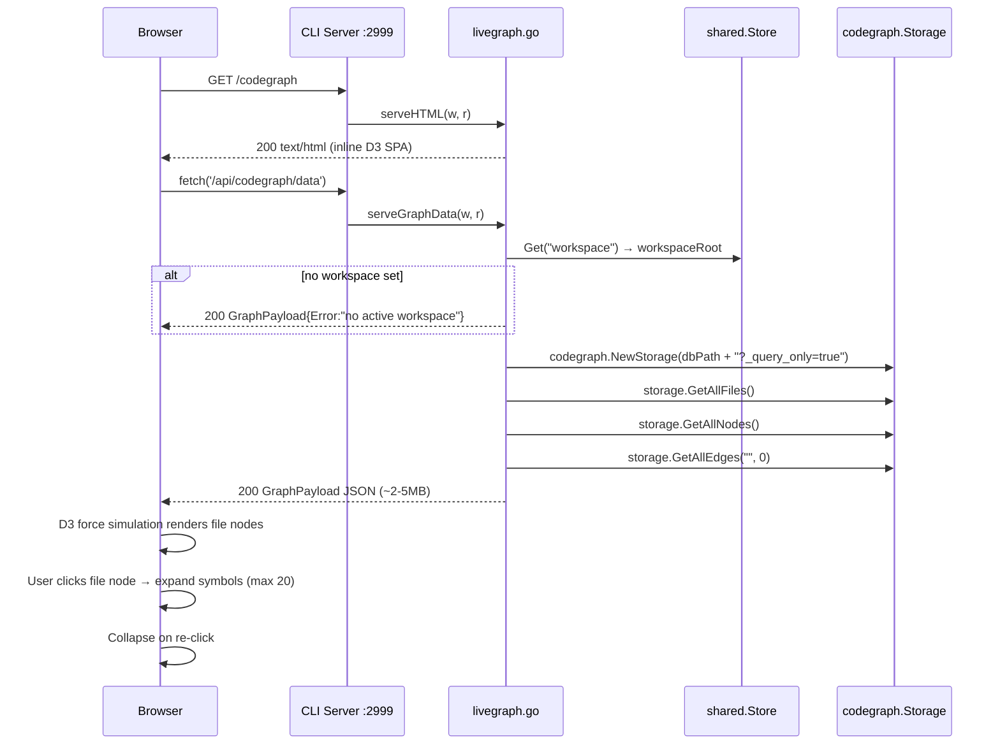

# Architecture Plan: Codegraph Live Viewer

> **Build-ready blueprint. Execute steps in order. Each step is atomic and self-contained.**

---

## Summary

Codegraph Live adds a human-readable interactive graph viewer to zen-mcp, accessible at `http://127.0.0.1:2999/codegraph`. It reads the active workspace's `codegraph.db` (at `{workspace}/.zenmcp/codegraph.db`) directly from the existing `codegraph.Storage` layer, dumps the full graph as a single JSON payload, and renders a D3.js force-directed SVG graph in the browser. The viewer is a pure SPA (no server round-trips after initial load), served as a Go inline string from a new `internal/server/livegraph.go` file. It is mounted only on the CLI mux (port 2999, the human-facing port) — the MCP mux (port 3001) is untouched. No new config keys, no new listeners, no build step.

---

## System Boundaries



---

## Data Flow



---

## Implementation Blueprint

> Each step is ordered by dependency. Step N may only begin when all steps it depends on are complete.

| # | File path | Action | Concrete signature / schema | Depends on | Done when… |
|---|-----------|--------|----------------------------|------------|------------|
| 1 | `internal/server/livegraph.go` | **Create** | Full type contracts below | — | `go build .` succeeds; package compiles |
| 2 | `main.go` | **Modify** | One-line call to `server.SetupLiveGraphRoutes(cliMux, store)` after line 172 | Step 1 | `GET http://127.0.0.1:2999/codegraph` returns HTTP 200 `text/html` |
| 3 | `internal/server/livegraph.go` | **Extend** | Implement `buildGraphPayload` using `codegraph.NewStorage` | Step 1 | `GET /api/codegraph/data` with active workspace returns valid `GraphPayload` JSON, `error` field absent |
| 4 | `internal/server/livegraph.go` | **Extend** | Write `liveGraphHTML` const: full D3 v7 inline SPA | Steps 1–3 | Browser at `/codegraph` renders force-directed graph; file-node click expands ≤20 symbol satellites; sidebar populates on node click |
| 5 | `internal/server/livegraph_test.go` | **Create** | Test stubs below | Steps 1–4 | `go test ./internal/server/...` passes |

---

### Step 1 & 3 — `internal/server/livegraph.go` (complete type contracts)

```go
package server

import (
    "encoding/json"
    "fmt"
    "net/http"
    "path/filepath"

    "github.com/user/zen-mcp/internal/codegraph"
    "github.com/user/zen-mcp/internal/shared"
)

// SetupLiveGraphRoutes registers /codegraph and /api/codegraph/data on mux.
// Called ONLY for the CLI mux (port 2999) in runHTTPServers — NOT via SetupRoutes.
func SetupLiveGraphRoutes(mux *http.ServeMux, store *shared.Store)

// serveHTML writes liveGraphHTML with Content-Type: text/html; charset=utf-8.
// Route: GET /codegraph
func serveHTML(w http.ResponseWriter, r *http.Request)

// serveGraphData reads active workspace from store, calls buildGraphPayload,
// writes result as JSON. Always HTTP 200; error surfaced via GraphPayload.Error.
// Route: GET /api/codegraph/data
func serveGraphData(w http.ResponseWriter, r *http.Request, store *shared.Store)

// buildGraphPayload opens codegraph.db read-only, queries files/nodes/edges,
// returns assembled GraphPayload. Error field is set (non-empty) on any failure.
// Never panics.
func buildGraphPayload(workspaceRoot string) GraphPayload

// --- Transfer types ---

type GraphPayload struct {
    Workspace string      `json:"workspace"`
    Files     []GraphFile `json:"files"`
    Nodes     []GraphNode `json:"nodes"`
    Edges     []GraphEdge `json:"edges"`
    Stats     GraphStats  `json:"stats"`
    Error     string      `json:"error,omitempty"`
}

type GraphFile struct {
    ID       int64  `json:"id"`
    Path     string `json:"path"`     // workspace-relative path
    Language string `json:"language"` // "go", "python", "typescript", etc.
    IsTest   bool   `json:"is_test"`
}

type GraphNode struct {
    ID        int64  `json:"id"`
    FileID    int64  `json:"file_id"`
    Type      string `json:"type"`      // "function"|"struct"|"class"|"method"|"type"|"const"|"var"
    Name      string `json:"name"`
    Signature string `json:"signature"`
    StartLine int    `json:"start_line"`
    EndLine   int    `json:"end_line"`
}

type GraphEdge struct {
    SourceID int64  `json:"source_id"` // file ID (level=file) or node ID (level=symbol)
    TargetID int64  `json:"target_id"`
    Relation string `json:"relation"`  // "imports"|"calls"|"uses"|"implements"|"inherits"
    Level    string `json:"level"`     // "file" | "symbol"
}

type GraphStats struct {
    FileCount int `json:"file_count"`
    NodeCount int `json:"node_count"`
    EdgeCount int `json:"edge_count"`
}
```

**`buildGraphPayload` pseudocode algorithm:**

```
1. dbPath = filepath.Join(workspaceRoot, ".zenmcp", "codegraph.db")
2. storage, err = codegraph.NewStorage(dbPath + "?_query_only=true")
   → on err: return GraphPayload{Error: fmt.Sprintf("cannot open codegraph db: %v", err)}
3. defer storage.Close()
4. files = storage.GetAllFiles()             // []codegraph.FileRecord
5. nodes = storage.GetAllNodes()             // []codegraph.NodeRecord
6. rawEdges = storage.GetAllEdges("", 0)     // []codegraph.EdgeRecord (all relations, no limit)

7. Build nodeToFileID map: nodeID → fileID   // for edge level tagging

8. Build fileNodeSet: set of all node IDs    // to check if edge endpoints are in index

9. For each rawEdge:
   - if relation == "imports":
       sourceFile = fileForNode(rawEdge.SourceID, nodeToFileID)
       targetFile = fileForNode(rawEdge.TargetID, nodeToFileID)
       if sourceFile != 0 && targetFile != 0:
           append GraphEdge{SourceID: sourceFile, TargetID: targetFile,
                            Relation: "imports", Level: "file"}
   - elif relation IN {"calls","uses","implements","inherits"}:
       append GraphEdge{SourceID: rawEdge.SourceID, TargetID: rawEdge.TargetID,
                        Relation: rawEdge.Relation, Level: "symbol"}

10. Map codegraph.FileRecord → GraphFile (copy ID, Path, Language, IsTest)
11. Map codegraph.NodeRecord → GraphNode (copy ID, FileID, Type, Name, Signature, StartLine, EndLine)
12. Return GraphPayload{Workspace, Files, Nodes, Edges, Stats{len(files), len(nodes), len(rawEdges)}}
```

> **NOTE on `GetAllEdges` vs `GetAllEdgeRecords`:** Use `storage.GetAllEdgeRecords("", 0)` (returns `[]RawEdgeRecord`) to get source/target node IDs. Then resolve file IDs using the `nodeToFileID` map built from step 7. The `GetAllEdges` method returns `[]EdgeRecord` which already has `SourceID`/`TargetID` as node IDs — either method works; prefer `GetAllEdgeRecords` (fewer columns scanned).

---

### Step 2 — `main.go` modification (exact location)

**File**: `main.go`  
**Function**: `runHTTPServers`  
**After line**: 172 (`server.SetupRoutes(cliMux, server.RouteDeps{...})` closing brace)

```go
// codegraph live viewer — CLI port only
server.SetupLiveGraphRoutes(cliMux, store)
```

No other changes to `main.go`. `RouteDeps` struct is unchanged. `SetupRoutes` is unchanged.

---

### Step 4 — `liveGraphHTML` const (SPA specification)

The const is a backtick-quoted Go string containing a complete standalone HTML document. D3.js v7 minified (~280KB) must be inlined — no CDN. The document structure:

```html
<!DOCTYPE html>
<html>
<head>
  <meta charset="UTF-8">
  <title>Codegraph Live</title>
  <style>
    /* Dark theme, sidebar right, graph fills remaining width */
    body { margin:0; background:#1a1a2e; color:#e0e0e0; font-family:monospace; display:flex; height:100vh; overflow:hidden; }
    #graph { flex:1; }
    #sidebar { width:320px; background:#16213e; padding:12px; overflow-y:auto; border-left:1px solid #0f3460; }
    #statusbar { position:fixed; bottom:0; left:0; width:100%; background:#0f3460; padding:4px 12px; font-size:11px; }
    .node-file circle { stroke:#fff; stroke-width:1.5; cursor:pointer; }
    .node-symbol circle { stroke:#aaa; stroke-width:0.8; cursor:pointer; }
    .link { stroke:#334; stroke-opacity:0.6; }
    .link.symbol { stroke:#446; stroke-dasharray:3,3; }
    #sidebar h3 { color:#00d4ff; margin-top:0; }
    #sidebar .field { margin:4px 0; font-size:12px; }
    #sidebar .label { color:#888; }
  </style>
</head>
<body>
  <svg id="graph"></svg>
  <div id="sidebar"><p style="color:#555">Click a node to inspect.</p></div>
  <div id="statusbar">Loading...</div>
  <script>/* D3 v7 minified inlined here */</script>
  <script>/* App logic — see contract below */</script>
</body>
</html>
```

**SPA app logic contract** (pseudocode for inline `<script>`):

```js
// === Constants ===
const LANGUAGE_COLORS = {
  "go":         "#00ADD8",
  "python":     "#3572A5",
  "javascript": "#F1E05A",
  "typescript": "#2B7489",
  "rust":       "#DEA584",
  "java":       "#B07219",
  "c":          "#555555",
  "cpp":        "#F34B7D",
  "ruby":       "#701516",
  "lua":        "#000080",
  "markdown":   "#083FA1",
  "":           "#888888",
};
const MAX_SATELLITES = 20;   // max symbol nodes per expanded file
const FILE_RADIUS_MIN = 6;
const FILE_RADIUS_MAX = 20;
const SYMBOL_RADIUS = 4;

// === Init ===
fetch('/api/codegraph/data')
  .then(r => r.json())
  .then(payload => {
    if (payload.error) { showError(payload.error); return; }
    updateStatus(`${payload.workspace} — ${payload.stats.file_count} files, ${payload.stats.node_count} nodes`);
    initGraph(payload);
  })
  .catch(err => showError(String(err)));

// === Graph init ===
function initGraph(payload) {
  // Build per-file symbol count for radius calculation
  const symbolsPerFile = {};  // fileID → count
  for (const n of payload.nodes) {
    symbolsPerFile[n.file_id] = (symbolsPerFile[n.file_id] || 0) + 1;
  }

  // Build D3 nodes from files
  const d3nodes = payload.files.map(f => ({
    id: "f_" + f.id,
    label: basename(f.path),
    language: f.language,
    _type: "file",
    _fileId: f.id,
    _data: f,
    r: clamp(FILE_RADIUS_MIN + Math.log2((symbolsPerFile[f.id] || 0) + 1) * 2,
             FILE_RADIUS_MIN, FILE_RADIUS_MAX),
    expanded: false,
    fx: null, fy: null,
  }));

  // Build file-level links from payload.edges where level === "file"
  const fileEdges = payload.edges.filter(e => e.level === "file");
  const d3links = fileEdges.map(e => ({
    source: "f_" + e.source_id,
    target: "f_" + e.target_id,
    relation: e.relation,
    level: "file",
  }));

  const svg = d3.select("#graph");
  const width = svg.node().clientWidth;
  const height = svg.node().clientHeight;

  // Pan/zoom
  const g = svg.append("g");
  svg.call(d3.zoom().on("zoom", e => g.attr("transform", e.transform)));

  // D3 force simulation
  const sim = d3.forceSimulation(d3nodes)
    .force("link", d3.forceLink(d3links).id(d => d.id).distance(80))
    .force("charge", d3.forceManyBody().strength(-300))
    .force("center", d3.forceCenter(width/2, height/2))
    .force("collide", d3.forceCollide(d => d.r + 4));

  // Render links and nodes
  let linkSel = g.append("g").selectAll("line");
  let nodeSel = g.append("g").selectAll("g");

  function update(nodes, links) {
    sim.nodes(nodes);
    sim.force("link").links(links);
    sim.alpha(0.3).restart();

    linkSel = linkSel.data(links, d => d.source.id + "-" + d.target.id + "-" + d.relation)
      .join("line")
      .attr("class", d => "link" + (d.level === "symbol" ? " symbol" : ""));

    nodeSel = nodeSel.data(nodes, d => d.id)
      .join(enter => {
        const grp = enter.append("g")
          .attr("class", d => "node-" + d._type)
          .call(d3.drag()
            .on("start", (event, d) => { if (!event.active) sim.alphaTarget(0.3).restart(); d.fx=d.x; d.fy=d.y; })
            .on("drag",  (event, d) => { d.fx=event.x; d.fy=event.y; })
            .on("end",   (event, d) => { if (!event.active) sim.alphaTarget(0); if (!d.pinned) { d.fx=null; d.fy=null; } })
          );
        grp.append("circle")
          .attr("r", d => d.r)
          .attr("fill", d => d._type === "file" ? LANGUAGE_COLORS[d.language || ""] : "#446");
        grp.append("text")
          .attr("dy", d => d.r + 10)
          .attr("text-anchor", "middle")
          .attr("font-size", 9)
          .attr("fill", "#ccc")
          .text(d => d.label);
        grp.on("click", (event, d) => {
          event.stopPropagation();
          if (d._type === "file") handleFileClick(d, nodes, links, update);
          else showNodeSidebar(d);
        });
        return grp;
      });

    sim.on("tick", () => {
      linkSel.attr("x1", d=>d.source.x).attr("y1", d=>d.source.y)
             .attr("x2", d=>d.target.x).attr("y2", d=>d.target.y);
      nodeSel.attr("transform", d => `translate(${d.x},${d.y})`);
    });
  }

  update(d3nodes, d3links);

  // === File expand/collapse ===
  function handleFileClick(fileNode, allNodes, allLinks, updateFn) {
    if (fileNode.expanded) {
      // Collapse: remove satellites linked to this file
      fileNode.expanded = false;
      fileNode.fx = null; fileNode.fy = null;
      const keepNodes = allNodes.filter(n => n._parentFileId !== fileNode._fileId);
      const keepLinks = allLinks.filter(l =>
        !allNodes.find(n => n._parentFileId === fileNode._fileId &&
          (n.id === l.source.id || n.id === l.target.id)));
      updateFn(keepNodes, keepLinks);
    } else {
      // Expand
      fileNode.expanded = true;
      fileNode.fx = fileNode.x; fileNode.fy = fileNode.y; // pin parent
      const myNodes = payload.nodes.filter(n => n.file_id === fileNode._fileId);
      const shown = myNodes.slice(0, MAX_SATELLITES);
      const overflow = myNodes.length - shown.length;

      const satellites = shown.map(n => ({
        id: "n_" + n.id,
        label: n.name,
        _type: "symbol",
        _nodeId: n.id,
        _parentFileId: fileNode._fileId,
        _data: n,
        r: SYMBOL_RADIUS,
        x: fileNode.x + (Math.random()-0.5)*40,
        y: fileNode.y + (Math.random()-0.5)*40,
      }));

      if (overflow > 0) {
        satellites.push({
          id: "overflow_" + fileNode._fileId,
          label: "+" + overflow + " more",
          _type: "overflow",
          _parentFileId: fileNode._fileId,
          r: SYMBOL_RADIUS,
          x: fileNode.x, y: fileNode.y + 30,
        });
      }

      // Satellite-to-parent links
      const satLinks = satellites
        .filter(s => s._type === "symbol")
        .map(s => ({ source: fileNode.id, target: s.id, relation: "contains", level: "file" }));

      // Symbol-level edges within this file
      const satIds = new Set(satellites.map(s => s._nodeId));
      const symLinks = payload.edges
        .filter(e => e.level === "symbol" && satIds.has(e.source_id) && satIds.has(e.target_id))
        .map(e => ({ source: "n_" + e.source_id, target: "n_" + e.target_id,
                     relation: e.relation, level: "symbol" }));

      updateFn([...allNodes, ...satellites], [...allLinks, ...satLinks, ...symLinks]);
    }
  }
}

// === Sidebar ===
function showNodeSidebar(d) {
  const data = d._data;
  document.getElementById("sidebar").innerHTML = `
    <h3>${data.name || data.path}</h3>
    <div class="field"><span class="label">Type:</span> ${data.type || "file"}</div>
    <div class="field"><span class="label">File:</span> ${data.path || ""}</div>
    <div class="field"><span class="label">Signature:</span><br><code>${data.signature || ""}</code></div>
    <div class="field"><span class="label">Lines:</span> ${data.start_line || ""}–${data.end_line || ""}</div>
  `;
}

// === Helpers ===
function basename(p) { return p.split("/").pop(); }
function clamp(v, min, max) { return Math.max(min, Math.min(max, v)); }
function showError(msg) {
  document.getElementById("statusbar").textContent = "Error: " + msg;
  document.getElementById("sidebar").innerHTML = `<p style="color:#f66">${msg}</p>`;
}
function updateStatus(msg) { document.getElementById("statusbar").textContent = msg; }
```

---

### Step 5 — `internal/server/livegraph_test.go`

```go
package server

import (
    "encoding/json"
    "net/http"
    "net/http/httptest"
    "os"
    "testing"

    "github.com/user/zen-mcp/internal/shared"
)

// TestServeHTMLReturns200 verifies GET /codegraph returns text/html; charset=utf-8.
func TestServeHTMLReturns200(t *testing.T) {
    mux := http.NewServeMux()
    store := shared.NewStore()
    SetupLiveGraphRoutes(mux, store)
    req := httptest.NewRequest("GET", "/codegraph", nil)
    w := httptest.NewRecorder()
    mux.ServeHTTP(w, req)
    if w.Code != 200 { t.Fatalf("expected 200, got %d", w.Code) }
    ct := w.Header().Get("Content-Type")
    if ct != "text/html; charset=utf-8" { t.Fatalf("unexpected Content-Type: %s", ct) }
}

// TestServeGraphDataNoWorkspace verifies that GET /api/codegraph/data returns HTTP 200
// with a GraphPayload{Error: non-empty} when shared.Store has no "workspace" key.
func TestServeGraphDataNoWorkspace(t *testing.T) {
    mux := http.NewServeMux()
    store := shared.NewStore() // empty — no workspace key
    SetupLiveGraphRoutes(mux, store)
    req := httptest.NewRequest("GET", "/api/codegraph/data", nil)
    w := httptest.NewRecorder()
    mux.ServeHTTP(w, req)
    if w.Code != 200 { t.Fatalf("expected 200, got %d", w.Code) }
    var p GraphPayload
    if err := json.Unmarshal(w.Body.Bytes(), &p); err != nil { t.Fatal(err) }
    if p.Error == "" { t.Fatal("expected non-empty Error field, got empty") }
}

// TestServeGraphDataBadPath verifies that /api/codegraph/data returns
// GraphPayload{Error: non-empty} when workspace path has no codegraph.db.
func TestServeGraphDataBadPath(t *testing.T) {
    mux := http.NewServeMux()
    store := shared.NewStore()
    store.Set("workspace", "/nonexistent/workspace/path")
    SetupLiveGraphRoutes(mux, store)
    req := httptest.NewRequest("GET", "/api/codegraph/data", nil)
    w := httptest.NewRecorder()
    mux.ServeHTTP(w, req)
    if w.Code != 200 { t.Fatalf("expected 200, got %d", w.Code) }
    var p GraphPayload
    if err := json.Unmarshal(w.Body.Bytes(), &p); err != nil { t.Fatal(err) }
    if p.Error == "" { t.Fatal("expected non-empty Error field for bad DB path") }
}

// TestGraphPayloadStructure verifies a real DB produces correct payload shape.
// Skipped unless CODEGRAPH_TEST_DB env var points to a real codegraph.db.
func TestGraphPayloadStructure(t *testing.T) {
    dbDir := os.Getenv("CODEGRAPH_TEST_DB")
    if dbDir == "" { t.Skip("CODEGRAPH_TEST_DB not set") }
    payload := buildGraphPayload(dbDir)
    if payload.Error != "" { t.Fatalf("unexpected error: %s", payload.Error) }
    if len(payload.Files) == 0 { t.Fatal("expected non-empty Files") }
    for _, e := range payload.Edges {
        if e.Level != "file" && e.Level != "symbol" {
            t.Fatalf("edge has invalid Level: %q", e.Level)
        }
    }
}
```

---

## Failure Modes

| Failure | Guard | Location |
|---------|-------|----------|
| No active workspace in `shared.Store` | Return `GraphPayload{Error:"No active workspace. Set one with: zworkspace <path>"}` HTTP 200 | `serveGraphData` in `livegraph.go` |
| `codegraph.db` absent (workspace not yet indexed) | `codegraph.NewStorage` error → `GraphPayload{Error:"cannot open codegraph db: ..."}` | `buildGraphPayload` |
| DB locked by concurrent writer during re-index | SQLite WAL mode; `?_query_only=true` open is a read-only connection — never blocks WAL writers | `buildGraphPayload` — SQLite WAL semantics |
| D3.js CDN unavailable | D3 v7 is inlined in `liveGraphHTML` — zero external requests | `liveGraphHTML` const |
| Empty workspace (0 files indexed) | `GraphPayload{Files:[], Nodes:[], Edges:[]}` → frontend renders "0 files indexed" in status bar | `buildGraphPayload` returns empty slices; JS handles empty arrays gracefully |
| Symbol expand produces 1500+ node explosion | Max `MAX_SATELLITES = 20` per expanded file; overflow shown as "+N more" phantom node | SPA JS `handleFileClick` |
| `/api/codegraph/data` race at startup | Route registered synchronously before `Serve()` is called | `main.go` ordering — `SetupLiveGraphRoutes` happens before `cliSrv.Serve(cliLn)` |
| Stale/moved workspace path in Store | `buildGraphPayload` gets error from `NewStorage` → returns `GraphPayload{Error:...}` | `buildGraphPayload` |
| CLI port unavailable (`cliAvailable=false`) | `SetupLiveGraphRoutes` is called before `Serve()`; if never served, route never receives requests — no panic | `main.go` conditional `cliSrv.Serve` already handles this |
| `fetch('/api/codegraph/data')` network error | `showError(String(err))` renders error message in sidebar and status bar | SPA JS `fetch().catch()` handler |

---

## Key Decisions

| Decision | Chosen | Alternatives Considered | Rejection Rationale |
|----------|--------|------------------------|---------------------|
| SPA vs SSR | **SPA (single JSON dump)** | SSR with per-action API calls | SSR requires per-interaction round-trips and query-param-based state; adds multiple API endpoints. SPA is one endpoint, zero server state after initial load |
| D3.js SVG vs Canvas | **D3.js SVG force-directed** | Canvas custom renderer; HTML table tree | Canvas: low maintainability, custom render loop required. Table: not a graph. D3 is canonical for codegraph visualizations (graphify, source-graph, etc.) |
| Asset embedding | **Inline Go const string** | `embed.FS` static dir; external frontend build (Vite/esbuild) | User confirmed inline — single-file, single-binary, no toolchain step. `embed.FS` would be cleaner but requires directory structure |
| Port | **CLI port 2999 only** | MCP port 3001; new dedicated web port | MCP port is agent-facing; non-MCP routes pollute it. New port adds listener and config complexity |
| Live update | **None (manual refresh)** | SSE push on DB mtime; N-second polling | SSE adds goroutine per connection + mtime watcher. User confirmed manual refresh sufficient. "Live" in the name refers to the human-viewable feature, not push updates |
| Graph granularity | **Two-level (file → expand symbols)** | File-only; Symbol-only | File-only loses richness; symbol-only = 1500+ node overload. Two-level progressive disclosure is correct |
| Workspace detection | **`shared.Store` active workspace** | Dropdown from projectmemory register map; `?workspace=` query param | Store already tracks active workspace — zero extra UX friction for the user |
| Session reuse vs fresh open | **Fresh open via `codegraph.NewStorage`** | Reuse `getSessionByWorkspace` from `internal/tools/codegraph.go` | `getSessionByWorkspace` is package-private; cross-package access would require export or package restructure. Fresh open is 3 lines and fully correct for a pure read path |
| `RouteDeps.CliMode bool` | **Rejected — call `SetupLiveGraphRoutes` directly** | Add `CliMode bool` to `RouteDeps`, call from inside `SetupRoutes` | `CliMode` creates invisible coupling; direct call in `main.go` is explicit, testable, and follows existing patterns (e.g., `StartIdleReaper` is also called directly) |

---

## Red-Team Critique Summary

> `zbrowser --action chat` was unavailable (Firefox bridge not running). Red-team performed internally by the architect with full adversarial rigor against Draft v1.

| Issue | Severity | Disposition |
|-------|---------|-------------|
| `CliMode bool` on `RouteDeps` creates invisible coupling | Critical | **Folded in** — `SetupLiveGraphRoutes` called directly in `main.go` after `SetupRoutes` |
| Opening fresh SQLite per request risks lock contention | Critical | **Folded in** — `?_query_only=true` flag; SQLite WAL already allows concurrent reads |
| Missing `Content-Type: text/html; charset=utf-8` header | Minor | **Folded in** — `serveHTML` sets explicit header |
| CORS headers needed on `/api/codegraph/data` | Minor | **Rejected** — same-origin (both endpoints port 2999), CORS not applicable |
| `const` string unwieldy for 1500-line HTML | Cosmetic | **Rejected** — user confirmed inline string preference; no embed.FS |
| No workspace in Store → uncaught 500 panic | Critical | **Folded in** — `GraphPayload{Error:"..."}` HTTP 200 path in `serveGraphData` |
| Two-level expand UX not concretely specified | Critical | **Folded in** — `MAX_SATELLITES=20`, collapse-on-reclick, "+N more" phantom, pin parent, restart simulation |
| `/codegraph` vs `/codegraph/` trailing slash | Minor | **Folded in** — register exact `GET /codegraph`; SPA JS no redirect |
| Language-to-color map left to implementer | Minor | **Folded in** — 11-entry `LANGUAGE_COLORS` map pinned |
| Edge relation filter not specified | Critical | **Folded in** — file-level: `imports` only; symbol-level: `calls`, `uses`, `implements`, `inherits` |

---

## Open Questions

None. All design decisions were resolved through grill-me interview (7 questions answered) and self-administered red-team pass (10 issues triaged).
