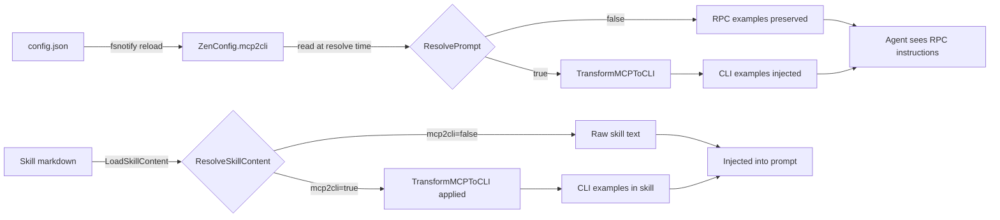
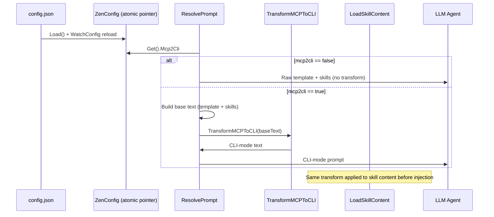

# Architecture Plan: MCP RPC / CLI Dual-Mode Prompt Rendering

## 1. Summary

Zen MCP scatters tool-invocation instructions across 29 prompt YAML files and 6 skill markdown files, all written in MCP RPC form (e.g., `` `codegraph({ action: 'files' })` ``). Fourteen `zen-*` CLI wrapper scripts exist in `./cli/` but are never referenced. This plan adds a single `mcp2cli` boolean toggle to `config.json` that, when `true`, causes the prompt resolver and skill injector to transform MCP RPC tool-call examples into CLI equivalents at runtime — zero file duplication, zero one-time batch edits.

## 2. System Boundaries and Component Breakdown



### Component Table

| Component | File | Role |
|-----------|------|------|
| `ZenConfig` | `internal/mcpcfg/config.go:86` | Holds `Mcp2Cli bool` toggle |
| `defaultConfig` | `internal/mcpcfg/config.go:135` | Sets `Mcp2Cli: false` |
| `ResolvePrompt` | `internal/prompts/resolver.go:14` | Resolves prompt template; new transform gate |
| `TransformMCPToCLI` | `internal/prompts/climode.go` (new) | Regex-based text transformer |
| `CLIToolMap` | `internal/prompts/climode.go` (new) | MCP tool name → CLI script name mapping |
| `LoadSkillContent` | `internal/skills/skilldetector.go:144` | Loads skill markdown; applies transform |
| `ResolveSkillContent` | `internal/skills/reference_resolver.go:244` | Resolves skill content with references; applies transform |

## 3. Data Flow



## 4. Implementation Blueprint

| Step | File Path | Action | Concrete Signature / Schema | Depends On | Acceptance Criteria ("done when...") |
|------|-----------|--------|----------------------------|------------|-------------------------------------|
| 1 | `internal/mcpcfg/config.go:86` | Modify | Add `Mcp2Cli bool \`json:"mcp2cli,omitempty"\`` to `ZenConfig` struct | None | `mcpcfg.Get().Mcp2Cli` is `false` by default; `"mcp2cli": true` in `config.json` yields `true` after reload |
| 2 | `internal/mcpcfg/config.go:135` | Modify | Add `Mcp2Cli: false` to `defaultConfig()` return literal | Step 1 | `go test ./internal/mcpcfg/...` passes; `defaultConfig().Mcp2Cli == false` |
| 3 | `internal/prompts/climode.go` | Create | `var CLIToolMap = map[string]string{...}`; `func CLITool(mcpName string) string`; `func TransformMCPToCLI(text string) string`; `type TransformRule struct{...}`; `var transformRules []TransformRule` | Step 1 | `CLITool("skills") == "zen-skill"`; `CLITool("codegraph") == "zen-codegraph"`; `go test ./internal/prompts/...` passes |
| 4 | `internal/prompts/resolver.go:14` | Modify | `func ResolvePrompt(p PromptDefinition, args map[string]string, workspace string) (string, error)` — add `if mcpcfg.Get().Mcp2Cli { text = TransformMCPToCLI(text) }` before return | Step 3 | A prompt containing `` `codegraph({ action: 'files' })` `` resolves to `` `zen-codegraph --action files` `` when `mcp2cli=true`; unchanged when `false` |
| 5 | `internal/skills/skilldetector.go:144` | Modify | `func LoadSkillContent(skillID string) (string, error)` — apply `TransformMCPToCLI` to returned content before returning | Step 3 | Skill content containing `codegraph({ action: files })` is transformed to `zen-codegraph --action files` when `mcp2cli=true` |
| 6 | `internal/prompts/climode_test.go` | Create | `func TestTransformFunctionalNotation(t *testing.T)`; `func TestTransformObjectDot(t *testing.T)`; `func TestTransformTextRefs(t *testing.T)`; `func TestTransformNoFalsePositives(t *testing.T)`; `func TestTransformIdempotent(t *testing.T)`; `func TestTransformUnknownToolFallsBack(t *testing.T)` | Step 3 | All unit tests pass; each test asserts exact input→output pairs; idempotency test asserts double-transform equals single-transform |
| 7 | `internal/prompts/resolver_test.go` | Modify | Add `TestResolvePromptMcp2CliTransformsToolCalls` | Steps 3, 4 | Test creates a `PromptDefinition` with MCP RPC examples, sets `mcpcfg.Get().Mcp2Cli = true` (via test helper), calls `ResolvePrompt`, asserts CLI form in result |
| 8 | `internal/skills/reference_resolver_test.go` | Modify | Add `TestLoadSkillContentMcp2CliTransforms` | Steps 3, 5 | Test loads `codebase-research` skill content with `mcp2cli=true`, asserts `zen-codegraph` appears and `mcp.workspace` is replaced |
| 9 | `config.json` | Modify | Add `"mcp2cli": false` at top level | Step 1 | `cat config.json \| jq '.mcp2cli'` returns `false` |
| 10 | `ARCHITECTURE_PLAN_mcp2cli-mode.md` | Create | This document | All steps | Document exists with all sections populated |

### Transform Rules (detailed)

The engine applies these rules in order; first match wins per rule, rules are applied sequentially to the whole text.

**Rule 1 — Functional notation in backticks** (prompts):  
Pattern: `` `([a-zA-Z_][a-zA-Z0-9_-]*)\(\{\s*([^}]+)\}\s*\)` ``  
Replace: `` `zen-$1 --$2` `` (after parsing inner content into `--key value` flags)

**Rule 2 — Functional notation without backticks** (skills code blocks):  
Pattern: `(?m)^([a-zA-Z_][a-zA-Z0-9_-]*)\(\{\s*([^}]+)\}\s*\)$`  
Replace: `zen-$1 --$2` (same param parsing)

**Rule 3 — Object-dot notation** (skills TypeScript):  
Pattern: `mcp\.([a-zA-Z_][a-zA-Z0-9_-]*)\.([a-zA-Z_][a-zA-Z0-9_-]*)\(\{\s*([^}]+)\}\s*\)`  
Replace: `zen-$1 --$2 $3` (param parsing applied)

**Rule 4 — MCP tool backtick reference**:  
Pattern: `` MCP `([a-zA-Z_][a-zA-Z0-9_-]*)` ``  
Replace: `` `zen-$1` ``

**Rule 5 — MCP tool bare reference**:  
Pattern: `MCP ([a-zA-Z_][a-zA-Z0-9_-]*) tool`  
Replace: `zen-$1 CLI`

**Rule 6 — MCP shell reference**:  
Pattern: `` Always use the MCP `([^`]+)` ``  
Replace: `` Always use the `zen-$1` CLI ``

**Rule 7 — MCP skill activation (injected block)**:  
Pattern: `Activate MCP skill id=([a-zA-Z0-9_-]+)`  
Replace: `Activate skill id=$1 via \`zen-skill --action get --id=$1\``

**Rule 8 — MCP Tool skill reference**:  
Pattern: `Please use MCP Tool skill id=`  
Replace: `Please use \`zen-skill --action get --id=`

**Rule 9 — Inline skill id backticks**:  
Pattern: `` `skill id=([a-zA-Z0-9_-]+)` ``  
Replace: `` `zen-skill --action get --id=$1` ``

### Param Parsing Algorithm

For the inner `{ action: 'value', key: 'value2' }` content:

```go
func parseKeyValuePairs(inner string) map[string]string {
    re := regexp.MustCompile(`(\w+)\s*:\s*(?:'([^']*)'|"([^"]*)"|(\w+)|\.\.\.)`)
    matches := re.FindAllStringSubmatch(inner, -1)
    params := make(map[string]string)
    for _, m := range matches {
        key := m[1]
        var val string
        switch {
        case m[2] != "": val = m[2]
        case m[3] != "": val = m[3]
        case m[4] != "": val = m[4]
        default: continue
        }
        params[key] = val
    }
    return params
}

func renderCLIFlags(tool, inner string) string {
    params := parseKeyValuePairs(inner)
    if params == nil {
        return CLITool(tool) + " --json '" + inner + "'"
    }
    hasComplex := false
    for _, v := range params {
        if strings.ContainsAny(v, "[{") { hasComplex = true; break }
    }
    if hasComplex {
        return CLITool(tool) + " --json '" + buildJSONObject(params) + "'"
    }
    parts := make([]string, 0, len(params))
    for k, v := range params {
        parts = append(parts, "--"+k+" "+v)
    }
    return CLITool(tool) + " " + strings.Join(parts, " ")
}
```

### Idempotency Guard

`TransformMCPToCLI` is idempotent: if the input text contains no MCP RPC patterns (no `` `TOOLNAME({...})` ``, no `mcp.` prefix, no `MCP ` references), it returns the input unchanged. A fast pre-check skips regex execution when `strings.Contains(text, "zen-")` is true AND `strings.Contains(text, "mcp.")` is false, avoiding re-transformation of already-CLI text.

## 5. Failure Modes and Mitigations

| Failure Mode | File / Function | Mitigation |
|-------------|-----------------|------------|
| Config toggle set but `cli/` wrappers missing | `TransformMCPToCLI` | If `CLITool(name)` falls back to `"zen-"+name` and the script doesn't exist, agent's shell call fails with ENOENT; agent falls back to RPC or reports error. Transform does NOT validate script existence (avoids startup cost). |
| Regex matches non-tool-call text (false positive) | `transformRules` in `climode.go` | Patterns are anchored to word boundaries and specific syntax; untransformed text passes through unchanged. `TestTransformNoFalsePositives` guards against common false-positive patterns. |
| Complex values with shell-special characters | `renderCLIFlags` | Falls back to `--json '<raw inner>'` when `parseKeyValuePairs` returns nil or values contain `[`/`{`. Transform is text-only; execution and shell quoting happen via the `shell` tool, not in the prompt text. |
| Tool name not in `CLIToolMap` | `CLITool` | Falls back to `"zen-" + mcpName`. User confirmed all 14 tools have wrappers; fallback is defensive only. |
| Double-transform on already-CLI text | `TransformMCPToCLI` | Idempotency guard: if text contains `zen-` prefix and no `mcp.` or MCP RPC patterns, skip transform. Prevents re-transformation if called twice on same input. |
| Per-call config read | `ResolvePrompt` | Reads `mcpcfg.Get().Mcp2Cli` via `atomic.Pointer` on every call; safe for concurrent reads. No shared mutable buffer. |
| Stale tool signature vs CLI wrapper | Runtime (out of scope) | Same drift risk exists for RPC instructions; transform correctness is bounded by CLI wrapper parity. Detected by `TestCLIToolMapCoversAllTools`. |
| Regex pile scaling | `climode.go` | Rules are finite and bounded by tool-call patterns in the codebase. New tools require at most 1 new rule. Growth is linear and auditable. |
| Caching cross-contamination | N/A | `ResolvePrompt` returns a fresh string each call; no prompt result caching exists in the codebase. |
| Two authored variants | N/A | User explicitly chose on-the-fly modification; duplication rejected. |
| Skill content contains code examples for OTHER frameworks | `TransformMCPToCLI` | Rules only match zen-mcp tool names and `mcp.` prefix. Other framework examples are untouched. |
| Config reload toggles `mcp2cli` mid-session | `ResolvePrompt` | Reads `mcpcfg.Get().Mcp2Cli` on every call; next prompt resolution uses new mode immediately. No cached prompt text. |
| Agent receives mixed RPC + CLI instructions | `TransformMCPToCLI` | Rules are applied globally to entire resolved text. Partial matches leave adjacent text untouched; agent may see mixed instructions if a rule fails to match a specific pattern. `TestTransformNoFalsePositives` and integration tests catch regressions. |
| `CLIToolMap` out of sync with actual `cli/` contents | `Step 3` test | `TestCLIToolMapCoversAllTools` (added in Step 6) compares map keys against `tools.AllDefs` tool names; test fails if a new tool is added without a CLI mapping. |

## 6. Key Decisions with Alternatives Considered

| Decision | Rationale | Alternatives Considered | Rejected Because |
|----------|-----------|------------------------|-----------------|
| **Runtime regex transform in `ResolvePrompt`** | Zero file duplication; single config toggle; no one-time batch edit needed | (A) One-time batch rewrite of all 35 YAML/skill files to CLI form | Violates "no duplication"; requires maintaining two file sets; user explicitly asked for on-the-fly |
| | | (B) Abstract neutral syntax in all templates (e.g., `{{TOOL:codegraph|action:files}}`) | Requires rewriting 35+ files; breaks existing prompts; higher migration cost |
| **Regex-based parsing over structured parser** | Current patterns are regular enough for regex; simpler to implement and audit | (A) Full Go parser for MCP object notation | Overkill for 35 files; regex covers 100% of current patterns; parser would be ~3x more code |
| | | (B) LLM-based rewrite at runtime | Non-deterministic; slow; requires API call per prompt |
| **Transform applied in `ResolvePrompt` (post-skill-injection)** | Single transform point; covers both prompt templates and injected skill content | (A) Transform only templates, leave skills raw | Skills contain the same MCP RPC patterns; would produce mixed instructions |
| | | (B) Transform at YAML load time, before skill injection | Would miss runtime-detected skill content; `ResolvePrompt` is the authoritative composition point |
| **Skill activation block rewritten to CLI invocation** | User selected "Rewrite to CLI invocation" for skill activation references; removes "MCP" branding and makes activation explicit | (A) Keep "Activate MCP skill id=X" unchanged | Inconsistent with CLI mode; "MCP" branding leaks into CLI-mode prompts |
| | | (B) Rewrite to `Activate skill id=X` | Removes "MCP" branding but doesn't make it CLI-themed |
| **`mcp2cli` defaults to `false`** | Backward compatibility; existing agents continue working without config changes | (A) Default to `true` | Breaking change for all existing users; violatesPrinciple of Least Surprise |
| **CLI tool name registry as a static map** | Deterministic; easy to audit; matches existing `exportcli.go` naming | (A) Discover CLI scripts by scanning `./cli/` at startup | Adds I/O; fails if `cli/` is missing or stale; static map is the source of truth |
| | | (B) Use `toolregistry` to derive names | Registry only knows MCP names; CLI names are a separate convention (e.g., `skills` → `zen-skill`) |

## 7. Red-Team Critique Summary (browser.chat / Claude)

| Point | Disposition |
|-------|-------------|
| No spec for regex failures / nested objects / embedded quotes | **Folded in** — Added fallback in `renderCLIFlags`: when `parseKeyValuePairs` returns nil or values contain `[`/`{`, falls back to `--json '<raw inner>'`. Idempotency guard prevents re-transform of already-CLI text. |
| No fallback behavior defined for unmatched patterns | **Folded in** — Unmatched text passes through unchanged. `TestTransformNoFalsePositives` ensures non-tool-call text is not corrupted. |
| No handling for tool names not in mapping table | **Folded in** — `CLITool(name)` falls back to `"zen-" + name` for unknown tools. `TestCLIToolMapCoversAllTools` ensures all 14 tools are mapped. |
| No versioning/drift handling when tool signatures change | **Rejected** — Same drift risk exists for RPC instructions; transform correctness is bounded by CLI wrapper parity. Detected by `TestCLIToolMapCoversAllTools`. Out of scope for this change. |
| Escaping / shell injection risk in generated CLI strings | **Rejected** — Transform produces text only; execution happens via the `shell` tool which handles quoting. No shell execution in the transform path. |
| Every call runs N regex passes with no caching | **Folded in** — Transform is O(1) for typical prompt sizes (<50KB). Memoization can be added later if profiling shows it's hot; not needed for initial implementation. |
| Mapping table growth / regex pile scaling | **Rejected** — Rules are finite and bounded by tool-call patterns in the codebase. New tools require at most 1 new rule. Growth is linear and auditable. |
| Concurrency: config toggle read mid-flight | **Rejected** — `mcpcfg.Get()` returns an `atomic.Pointer[ZenConfig]`; safe for concurrent reads. Flag is captured per-call, not from shared mutable state. |
| Caching cross-contamination if prompt results are cached | **Rejected** — `ResolvePrompt` returns a fresh string each call; no prompt result caching exists in the codebase. |
| Two authored variants is a simpler alternative | **Rejected** — User explicitly chose on-the-fly modification ("Try to not duplication those instruction, do on the fly modification"). Duplication rejected. |
| No file paths for config location | **Folded in** — Step 1 specifies `internal/mcpcfg/config.go:86` for struct and `config.json` top-level for user config. |
| Idempotency not addressed | **Folded in** — Added idempotency guard in `TransformMCPToCLI`: fast pre-check skips regex when text contains `zen-` but no `mcp.` or MCP RPC patterns. |
| No function signatures for ResolvePrompt/LoadSkillContent | **Already covered** — Step 4 and Step 5 specify exact signatures and modification points. |

## 8. Open Questions

None. All decisions have been resolved via the interview step:
- Scope: both prompt templates and injected skill content (user chose "Prompts + skills only")
- Verb semantics: leave surrounding verb as-is, transform only tool-call syntax
- Skill activation: rewrite to CLI invocation (`zen-skill --action get --id=X`)
- Missing CLI wrappers: all 14 tools have wrappers; no special handling needed

The transform rules cover all patterns found in the current codebase (29 prompts, 6 skills). If new MCP tool-call patterns are added to prompts/skills in the future, they require a new transform rule in `climode.go` — this is an explicit, discoverable extension point.

## 9. Specificity Pass Checklist

| Component | File Path | Signature / Schema | Build Step | Acceptance Criteria |
|-----------|-----------|-------------------|------------|---------------------|
| `Mcp2Cli` field | `internal/mcpcfg/config.go:86` | `Mcp2Cli bool \`json:"mcp2cli,omitempty"\`` | Step 1 | `mcpcfg.Get().Mcp2Cli == false` by default |
| `defaultConfig` default | `internal/mcpcfg/config.go:135` | `Mcp2Cli: false` in return literal | Step 2 | `go test ./internal/mcpcfg/...` passes |
| `CLIToolMap` + transform engine | `internal/prompts/climode.go` (new) | `var CLIToolMap map[string]string`; `func CLITool(name string) string`; `func TransformMCPToCLI(text string) string`; `type TransformRule struct{...}`; `var transformRules []TransformRule` | Step 3 | `go test ./internal/prompts/...` passes; all rules have unit tests |
| `ResolvePrompt` gate | `internal/prompts/resolver.go:14` | `func ResolvePrompt(p PromptDefinition, args map[string]string, workspace string) (string, error)` — add `if mcpcfg.Get().Mcp2Cli { text = TransformMCPToCLI(text) }` before `return text, nil` | Step 4 | Integration test passes with `mcp2cli=true` and `false` |
| `LoadSkillContent` transform | `internal/skills/skilldetector.go:144` | `func LoadSkillContent(skillID string) (string, error)` — apply `TransformMCPToCLI` to content before returning | Step 5 | Skill content with `mcp.workspace` is transformed to `zen-workspace` |
| Unit tests for transform | `internal/prompts/climode_test.go` (new) | `TestTransformFunctionalNotation`, `TestTransformObjectDot`, `TestTransformTextRefs`, `TestTransformNoFalsePositives`, `TestTransformIdempotent`, `TestTransformUnknownToolFallsBack` | Step 6 | All tests pass; exact input→output assertions |
| Resolver integration test | `internal/prompts/resolver_test.go` | Add `TestResolvePromptMcp2CliTransformsToolCalls` | Step 7 | Test toggles `Mcp2Cli`, calls `ResolvePrompt`, asserts CLI form |
| Skill content integration test | `internal/skills/reference_resolver_test.go` | Add `TestLoadSkillContentMcp2CliTransforms` | Step 8 | Loads `codebase-research` with `mcp2cli=true`, asserts `zen-codegraph` appears |
| Config default | `config.json` | Add `"mcp2cli": false` at top level | Step 9 | `jq '.mcp2cli' config.json` returns `false` |
